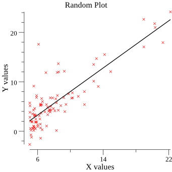

# go-linear-regression
Linear Regression with Gradient Descent on a given set of points

### Overview
Using linear regression with gradient decent to find a line that passes through a set of points,
 without using any specific framework except for plotting.
 
### Running
```sh
$ go run main.go
```
Specify number of iterations

```sh
$ go run main.go -n 10000
```

### References:
- gonum: https://gonum.org
- gonum/plot docs: https://godoc.org/gonum.org/v1/plot

### Sample output

